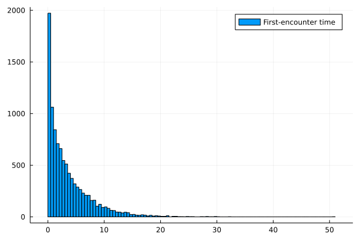

```{r setup, include=FALSE}
knitr::opts_chunk$set(echo = FALSE, message = FALSE)
knitr::knit_engines$set(julia = JuliaCall::eng_juliacall)
```
```{julia}
include("../scripts/PRNG.jl")
using .PRNG
using Plots
```

## Introduction

In my research project, I explore (mostly analytically) the properties on first-encounters of stochastic processes with "home-ranging" behavior, representing the trajectories of an animal in space as one might obtain by GPS tracking or related techniques. It known that properties of encounter rates at stationarity offer corrections to many classical models in population dynamics [@MARTINEZGARCIA2020110267]. The study of first-encounters[@Redner2001-go] given some initial configuration of the system is of great interest, as they may represent complex spatio-temporal interactions between agents, such as the event of a predator finding a prey or a vehicular collision as an animal crosses a road. 

We can start by considering the differential equation

$$
\begin{aligned}
  d\boldsymbol{x}/dt &= -\frac{1}{\tau}(\boldsymbol x - \boldsymbol \lambda) + \sqrt{g}\xi(t), \\
  \langle \xi(t) \rangle &= 0, \\
  \langle \xi(t)\xi(t')\rangle &= \delta(x-x').
\end{aligned}
$$

The equation above describes the position $\boldsymbol x \in \mathbb R^2$ of an object that is attracted to a point $\boldsymbol \lambda \in \mathbb R^2$ with a characteristic return rate $\tau$. At the same time, this it is subject to some stochastic white noise $\xi(t)$, which can be thought of as a continuous family of independent, identically distributed standard normal variables. Integrating the above equation in the interval $[t, t+\Delta t]$ reveals that 

$$
  \boldsymbol x(t + \Delta t) = \boldsymbol x(t)\exp(-\Delta t/\tau) + (1- \exp(-\Delta t/\tau))\boldsymbol \lambda + \sqrt{\frac{g\tau}{2}(1 - \exp(-2\Delta t/\tau))} \boldsymbol u
$$
where $\boldsymbol u \sim \mathcal N((0,0),1)$. As such, the numerical integration of the OU process reduces to the generation of normal random variables. By taking moments of the equation above, one can furthermore find that $x\sim \mathcal N(\boldsymbol \mu(t),\sigma^2(t))$, with 

$$
\begin{aligned}
  \langle \xi(t) \rangle &= 0, \\
  \langle \xi(t)\xi(t')\rangle &= \delta(x-x').
\end{aligned}
$$


## Generating trajectories

A necessary step in implementing a simulation of any stochastic process is having a reliable means of producing "random" numbers. For purposes of reproducibility and efficiency, it is better to produce effectively randomly-distributed deterministic sequences of numbers than actually sampling "real" sources of randomness.

To this end, we implement a linear congruential generator[@Toral2014-fo], an efficient if somewhat flawed pseudo-random number generation method. It is extremely simple: given some integers $a$, $c$ and $M$, and an initial seed $x_0$, it produces the sequence

$$
x_{i+1} = a x_i + c \mod M.
$$

It is typical to choose $M = 2^{64}$, so that the modulo operation is done at "zero cost" by integer overflow (assuming a 64-bit architecture). The choice of $a$ and $c$ should be optimized as well to ensure the sequence is fairly aperiodic (as this sequence necessarily has a period of at most $M$). The values $a = 2862933555777941757$, $c = 3037000493$ are used throughout, to produce a fairly uniform distribution (Figure \ref{fig:lcghist})

```{julia lcghist, fig.cap="\\label{fig:lcghist} Distribution of 100000 samples from our Linear Congruential Generator"}
rng = LCG(1000)
histogram(PRNG.rand(rng, 100000))
```

Now, as we'd calculated before, the actual distribution we need to sample is not $U[0,1]$ but rather $\mathcal N(0,1)$, and in particular two i.i.d such variables. This is done by performing the Box-Muller transformation on pairs of $U[0,1]$ samples. If $X$, $Y$ are i.i.d $\mathcal N(0,1)$ variables, then, by taking $(R, \Theta)$ the polar representation of the vector $(X, Y)$, one can show that

$$
\begin{aligned}
 U_1 &= \exp\left(-R^2/2\right),\\
 U_2 &= \Theta/2\pi
\end{aligned}
$$
are i.i.d $U[0,1]$ variables. With a means to generate normal random variables, the generation of trajectories is very simple, as one simply iterates the equation for the OU process integrated over a finite interval. 

## First Encounter Statistics

Heading on to the study of interactions through spatial movement, we look into the following process: Consider two identical independent OU processes and initialize them randomly according to their stationary distributions (which as one can see above, is $\mathcal N(\boldsymbol\lambda, g\tau/2)$). By measuring space and time in the natural scales of the process, we can impose $\tau = g\tau = 1$ without loss of generality. We allow these processes to evolve in time until they enter each other's "interaction range", defined as a distance $\epsilon$ from one another. At this moment, one terminates the process and records the position and time of the event. Looking at the distribution of encounter times, we find a characteristic decay (Figure \ref{fig:encounters})




## References